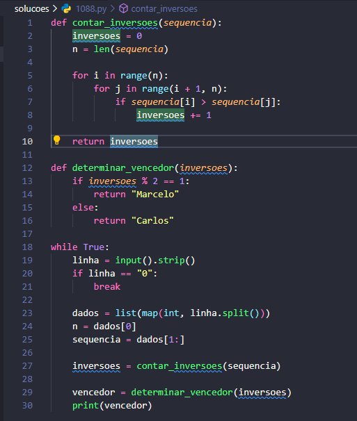
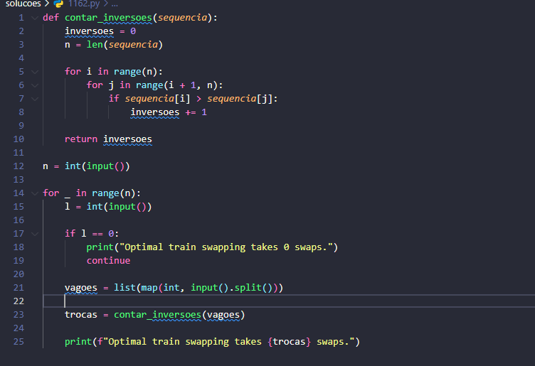
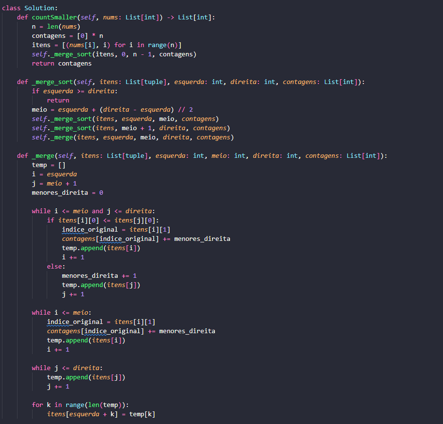

# DC_Questoes_URI

<!-- **Número da Lista**: X  -->
**Conteúdo da Disciplina**: Dividir e Conquistar 

## Alunos
| Matrícula  | Aluno                               |
| ---------- | ----------------------------------- |
| 18/0015311 | Danilo Domingo Vitoriano Silva      |
| 20/0058576 | Joao Victor Marques Reis de Miranda |

## Sobre 
Este repositório foi criado para a soluções de problemas de juízes online, que são dos temas abordados na disciplina de Projeto de Algoritmos.

## Problemas Resolvidos

Tabela com os links para as devidas questões.

| Problema | Dificuldade | Método | Solução Código | Responsável                             |
| -------- | ----------- | ------ | -------------- | --------------------------------------- |
| [1088 - Bolhas e Baldes](https://judge.beecrowd.com/pt/problems/view/1088) | Difícil (6) | Counting Inversions | [1088.py](./solucoes/1088.py) | [Danilo](https://github.com/danilow200) |
| [1162 - Organizador de Vagões](https://judge.beecrowd.com/pt/problems/view/1162) | Médio (5) | Counting Inversions | [1162.py](./solucoes/1162.py) | [Danilo](https://github.com/danilow200) |
| [315 - Contagem de números menores após si mesmo](https://leetcode.com/problems/count-of-smaller-numbers-after-self/description/) | Difícil (7) | MergeSort | [315.py](./solucoes/315.py) | [Joao Victor Marques](https://github.com/jmarquees) |

## Screenshots

### Problema 1088 - Bolhas e Baldes

### Problema 1162 - Organizador de Vagões

### Problema 315 - Contagem de números menores após si mesmo

## Instalação 
**Linguagem**: Python 

Foi utilizado o **Python 3.13**

## Vídeo

Video de Apresentação do projeto:

  <!-- 
<a href="./assets/Trabalho_de_PA_Grafo1.mp4">Vídeo de Apresentação</a>
 -->
  
<a href="">Apresentação no YouTube</a>

